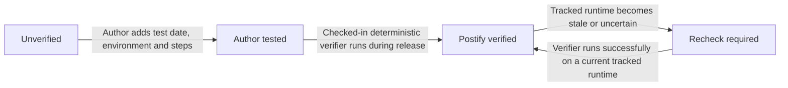
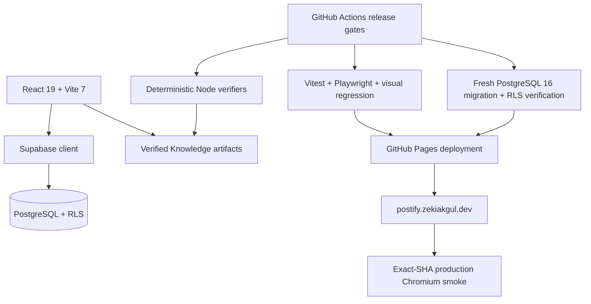

<div align="center">
  

# Postify

### Knowledge you can verify, not just read.

A verified knowledge network for developers and builders — combining reproducible guides, evidence, freshness signals, and community validation.

[**Open Postify**](https://postify.zekiakgul.dev/) · [**How verification works**](#how-verification-works) · [**Contribute**](CONTRIBUTING.md) · [**Support**](SUPPORT.md) · [**Türkçe README**](README.tr.md)

[](https://github.com/zexy2/postify/actions/workflows/ci.yml)
[](https://postify.zekiakgul.dev/)
[](https://nodejs.org/)
[](LICENSE)

</div>


## Why Postify?

Most technical content tells you what somebody wrote. Postify is designed to also show **what was tested, when it was tested, under which environment, and whether that evidence is still current**.

| | Postify signal | What it answers |
|---|---|---|
| 🧪 | **Reproducible verification** | Can this claim be executed and checked? |
| 🧾 | **Evidence & provenance** | What supports the claim? |
| 🕒 | **Freshness** | Is the verification still current for the tracked runtime? |
| 👥 | **Community validation** | Did it work for other authenticated users? |

Postify is not trying to be another generic blog clone. Its core product idea is **Verified Knowledge**: practical technical knowledge with explicit trust states instead of an undifferentiated “published = trustworthy” model.

## Knowledge formats

Postify treats different kinds of technical writing differently:

- **Guide** — completes a concrete task.
- **Decision note** — makes options, constraints, and trade-offs visible.
- **Explainer** — builds a fast, accurate mental model.
- **Field note** — records the result and lesson from a real experience.

## How verification works

Postify deliberately separates author claims from platform-derived verification.



### Trust states

- **Unverified** — the author does not claim a test was performed.
- **Author tested** — the post includes meaningful environment/version information, a valid test date, and verification steps. This remains an author assertion.
- **Postify verified** — cannot be selected by an author. It is derived only when checked-in deterministic verification code actually runs, the displayed code matches the verified artifact, and the tracked runtime freshness remains current.

Authenticated users can submit **Worked / Didn’t work** evidence to Supabase. Public surfaces expose privacy-safe aggregates rather than raw user identities or private notes. Signed-out feedback remains local to the device.


## Production

**Live app:** https://postify.zekiakgul.dev/

Machine-readable trust surfaces are published alongside the UI:

- `/verification-runs.json`
- `/runtime-release-status.json`
- `/knowledge-backend-status.json`
- `/knowledge/<slug>.<locale>.json`
- `/llms.txt`

The production pipeline stamps every deployment with its source commit and waits for the **exact source SHA** to become observable before the final Chromium smoke suite runs.

## Architecture



### Stack

- **Frontend:** React 19, Vite 7, React Router 7
- **State & data:** Redux Toolkit, TanStack Query, Supabase
- **Editor:** TipTap
- **Database:** PostgreSQL + Row Level Security
- **Testing:** Vitest, Testing Library, Playwright
- **PWA:** Workbox / Vite PWA
- **Delivery:** GitHub Actions + GitHub Pages
- **Hosted verification runtime:** Node 24 LTS (`24.20.0` in the current workflow)

## Quick start

### Prerequisites

- Node.js 24 LTS recommended
- npm
- A Supabase project if you want authenticated/backend-backed features locally

### 1. Clone

```bash
git clone https://github.com/zexy2/postify.git
cd postify
```

### 2. Install dependencies

```bash
npm ci
```

### 3. Configure environment

```bash
cp .env.example .env.local
```

Then provide your local values:

```env
VITE_SUPABASE_URL=https://your-project.supabase.co
VITE_SUPABASE_ANON_KEY=your-anon-key
VITE_APP_URL=http://localhost:5173
VITE_APP_NAME=Postify
```

Never place a Supabase `service_role` secret or any other server secret in the browser bundle.

### 4. Run locally

```bash
npm run dev
```

## Quality gates

The repository uses fail-closed release checks rather than treating a successful build as sufficient proof of quality.

```bash
# Knowledge verification + unit tests + lint + build + build smoke
npm run verify

# Dependency/security and browser-runner parity checks
npm run verify:security

# Chromium product tests
npm run test:e2e:ui

# Deterministic visual regression
npm run test:e2e:visual
```

Database migration changes are also replayed from scratch on PostgreSQL 16 and verified with `supabase/verify-verified-knowledge.sql` before deployment is allowed.

## Repository map

```text
.
├── src/                     # React application, features and content
├── e2e/                     # Chromium product tests
├── scripts/                 # Verification, release and artifact tooling
├── supabase/                # Migrations and database verification
├── public/                  # Static public assets and machine-readable surfaces
├── .github/workflows/       # CI/CD and production migration workflows
├── CONTRIBUTING.md          # Contribution workflow
├── SECURITY.md              # Vulnerability reporting policy
├── SUPPORT.md               # Help and reporting routes
└── CODE_OF_CONDUCT.md       # Community standards
```

## Security model & important boundaries

- The automatic verifier is **not** a sandbox for arbitrary or untrusted code. It is restricted to checked-in deterministic verification snippets.
- `Postify verified` is never author-writable database metadata.
- Evidence counts and authenticated browser coverage must come from real persisted data; they are not synthesized for presentation.
- Supabase Row Level Security is verified as part of the CI schema gate.
- Browser-exposed environment values must never contain service-role or other server secrets.
- GitHub Pages deep-link first-request behavior is treated as a hosting constraint and tested separately from the browser fallback path.

See [SECURITY.md](SECURITY.md) before reporting a vulnerability.

## Contributing

Contributions are welcome. Start with [CONTRIBUTING.md](CONTRIBUTING.md), use the repository’s issue forms for bugs/features, and keep pull requests focused and testable.

For community behavior expectations, see [CODE_OF_CONDUCT.md](CODE_OF_CONDUCT.md).

## License

Postify is released under the [MIT License](LICENSE).

---

<div align="center">
  <strong>Read less blindly. Verify more deliberately.</strong>
</div>
