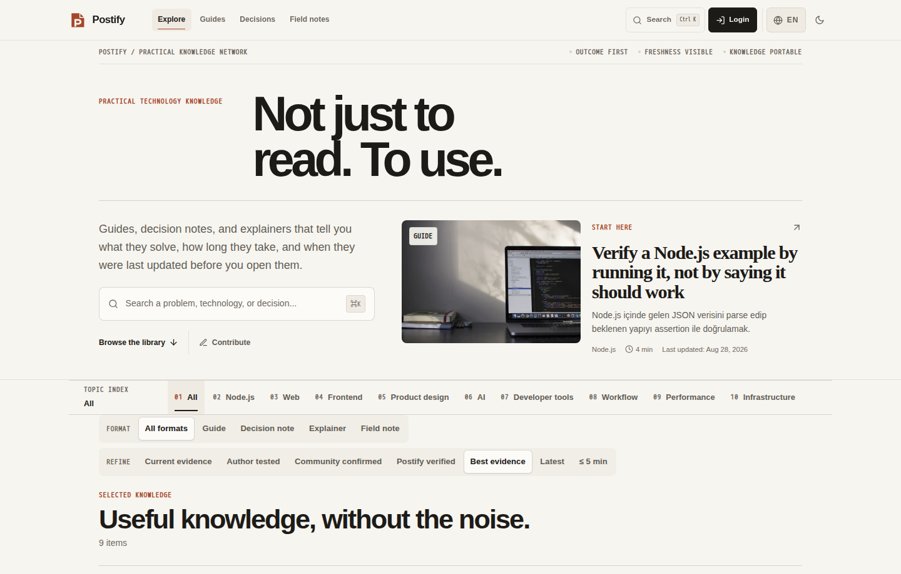
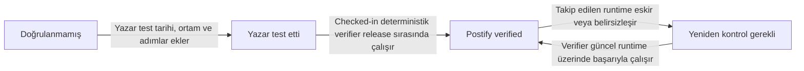
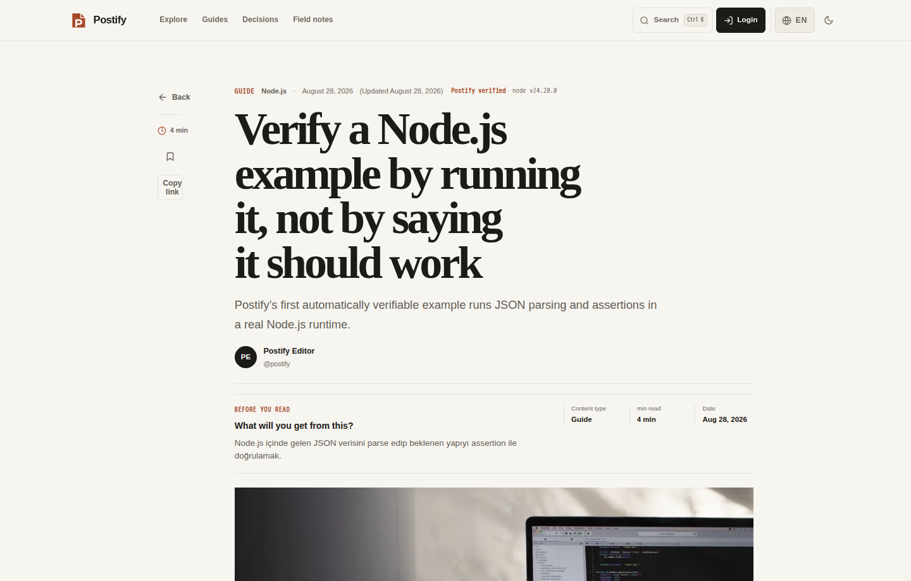
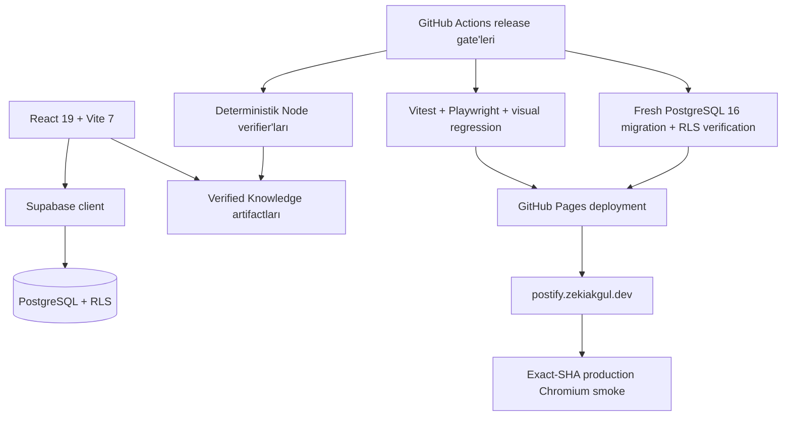

<div align="center">
  

# Postify

### Sadece okuduğun değil, doğrulayabildiğin bilgi.

Geliştiriciler ve ürün üretenler için; yeniden üretilebilir rehberleri, kanıtı, güncellik sinyallerini ve topluluk doğrulamasını bir araya getiren Verified Knowledge ağı.

[**Postify’ı Aç**](https://postify.zekiakgul.dev/) · [**Doğrulama nasıl çalışıyor?**](#doğrulama-nasıl-çalışıyor) · [**Katkıda bulun**](CONTRIBUTING.md) · [**Destek**](SUPPORT.md) · [**English README**](README.md)

[](https://github.com/zexy2/postify/actions/workflows/ci.yml)
[](https://postify.zekiakgul.dev/)
[](https://nodejs.org/)
[](LICENSE)

</div>



## Neden Postify?

Çoğu teknik içerik sana yalnızca **birinin ne yazdığını** söyler. Postify ise ayrıca **neyin test edildiğini, ne zaman test edildiğini, hangi ortamda doğrulandığını ve bu kanıtın hâlâ güncel olup olmadığını** görünür kılmak için tasarlanmıştır.

| | Postify sinyali | Cevapladığı soru |
|---|---|---|
| 🧪 | **Yeniden üretilebilir doğrulama** | Bu iddia çalıştırılıp kontrol edilebilir mi? |
| 🧾 | **Kanıt ve kaynak** | İddiayı ne destekliyor? |
| 🕒 | **Güncellik** | Doğrulama takip edilen runtime için hâlâ güncel mi? |
| 👥 | **Topluluk doğrulaması** | Diğer authenticated kullanıcılar için çalıştı mı? |

Postify bir başka genel amaçlı blog klonu olmaya çalışmaz. Ürünün merkezinde **Verified Knowledge** vardır: “yayınlandı = güvenilir” varsayımı yerine açık güven durumlarıyla sunulan uygulanabilir teknik bilgi.

## Bilgi biçimleri

Postify farklı teknik içerik türlerini aynı kefeye koymaz:

- **Rehber** — somut bir işi tamamlatır.
- **Karar notu** — seçenekleri, kısıtları ve ödünleşimleri görünür kılar.
- **Açıklayıcı** — hızlı ve doğru bir zihinsel model kurar.
- **Saha notu** — gerçek bir deneyimin sonucunu ve dersini kaydeder.

## Doğrulama nasıl çalışıyor?

Postify, yazar beyanı ile platform tarafından türetilen doğrulamayı bilinçli biçimde ayırır.



### Güven durumları

- **Doğrulanmamış / Unverified** — yazar test yaptığı iddiasında bulunmaz.
- **Yazar test etti / Author tested** — anlamlı ortam/sürüm bilgisi, geçerli test tarihi ve doğrulama adımları vardır. Bu hâlâ bir yazar beyanıdır.
- **Postify verified** — yazar tarafından seçilemez. Yalnız checked-in deterministik doğrulama kodu gerçekten çalıştığında, gösterilen kod doğrulanan artifact ile eşleştiğinde ve takip edilen runtime güncelliği `current` olduğunda türetilir.

Authenticated kullanıcılar **Çalıştı / Çalışmadı** kanıtı gönderebilir. Public yüzeyler ham kullanıcı kimliği veya özel notlar yerine privacy-safe aggregate gösterir. Giriş yapılmadan gönderilen geri bildirim cihazda kalır.



## Production

**Canlı uygulama:** https://postify.zekiakgul.dev/

UI ile birlikte machine-readable güven yüzeyleri de yayınlanır:

- `/verification-runs.json`
- `/runtime-release-status.json`
- `/knowledge-backend-status.json`
- `/knowledge/<slug>.<locale>.json`
- `/llms.txt`

Production pipeline her deploy’u kaynak commit’i ile damgalar ve son Chromium smoke suite’ini çalıştırmadan önce **tam olarak beklenen source SHA’nın** production’da görünmesini bekler.

## Mimari



### Teknoloji yığını

- **Frontend:** React 19, Vite 7, React Router 7
- **State & data:** Redux Toolkit, TanStack Query, Supabase
- **Editör:** TipTap
- **Veritabanı:** PostgreSQL + Row Level Security
- **Test:** Vitest, Testing Library, Playwright
- **PWA:** Workbox / Vite PWA
- **Dağıtım:** GitHub Actions + GitHub Pages
- **Hosted verification runtime:** Node 24 LTS (mevcut workflow’da `24.20.0`)

## Hızlı başlangıç

### Gereksinimler

- Önerilen: Node.js 24 LTS
- npm
- Authenticated/backend özelliklerini yerelde kullanmak istiyorsanız bir Supabase projesi

### 1. Repoyu klonlayın

```bash
git clone https://github.com/zexy2/postify.git
cd postify
```

### 2. Bağımlılıkları kurun

```bash
npm ci
```

### 3. Ortam değişkenlerini hazırlayın

```bash
cp .env.example .env.local
```

Ardından kendi değerlerinizi girin:

```env
VITE_SUPABASE_URL=https://your-project.supabase.co
VITE_SUPABASE_ANON_KEY=your-anon-key
VITE_APP_URL=http://localhost:5173
VITE_APP_NAME=Postify
```

Supabase `service_role` secret veya başka bir server secret değerini browser bundle’a **asla** koymayın.

### 4. Yerelde çalıştırın

```bash
npm run dev
```

## Kalite kapıları

Repo, başarılı build’i tek başına yeterli kalite kanıtı kabul etmez; release kontrolleri fail-closed çalışır.

```bash
# Knowledge verification + unit test + lint + build + build smoke
npm run verify

# Dependency/security ve browser-runner parity
npm run verify:security

# Chromium ürün testleri
npm run test:e2e:ui

# Deterministik visual regression
npm run test:e2e:visual
```

Veritabanı migration değişiklikleri de deploy öncesinde PostgreSQL 16 üzerinde sıfırdan uygulanır ve `supabase/verify-verified-knowledge.sql` ile doğrulanır.

## Repo yapısı

```text
.
├── src/                     # React uygulaması, özellikler ve içerik
├── e2e/                     # Chromium ürün testleri
├── scripts/                 # Verification, release ve artifact araçları
├── supabase/                # Migration ve DB doğrulaması
├── public/                  # Static asset ve machine-readable yüzeyler
├── .github/workflows/       # CI/CD ve production migration workflow'ları
├── CONTRIBUTING.md          # Katkı akışı
├── SECURITY.md              # Güvenlik açığı bildirim politikası
├── SUPPORT.md               # Destek ve bildirim kanalları
└── CODE_OF_CONDUCT.md       # Topluluk standartları
```

## Güvenlik modeli ve önemli sınırlar

- Otomatik verifier, arbitrary/untrusted kod için bir sandbox değildir; checked-in deterministik doğrulama snippet’leriyle sınırlıdır.
- `Postify verified` hiçbir zaman yazar tarafından yazılabilir DB metadata’sı değildir.
- Kanıt sayaçları ve authenticated browser coverage gerçek persisted veriden gelmelidir; sunum için uydurulmaz.
- Supabase Row Level Security, CI schema gate’in bir parçası olarak doğrulanır.
- Browser’a açılan environment değerleri service-role veya başka server secret’ları içermemelidir.
- GitHub Pages deep-link ilk-request davranışı ayrı bir hosting kısıtı olarak ele alınır ve browser fallback akışından ayrı test edilir.

Bir güvenlik açığı bildirmeden önce [SECURITY.md](SECURITY.md) dosyasını okuyun.

## Katkıda bulunma

Katkılar memnuniyetle karşılanır. [CONTRIBUTING.md](CONTRIBUTING.md) ile başlayın, hata/özellik taleplerinde repo issue formlarını kullanın ve pull request’leri dar kapsamlı ve test edilebilir tutun.

Topluluk davranış beklentileri için [CODE_OF_CONDUCT.md](CODE_OF_CONDUCT.md) dosyasına bakın.

## Lisans

Postify [MIT License](LICENSE) altında yayınlanır.

---

<div align="center">
  <strong>Daha az körü körüne oku. Daha bilinçli doğrula.</strong>
</div>
